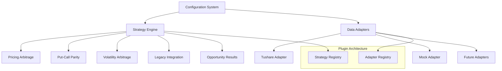

# Options Arbitrage Interface System

A comprehensive, type-safe, and extensible interface system for options arbitrage scanning. This system provides a unified framework for managing configurations, data sources, and arbitrage strategies with plugin architecture.

## 🏗️ Architecture Overview



## 📦 Core Components

### 1. Configuration System (`src/config/`)

**Type-safe configuration management using Pydantic**

- **Models** (`models.py`): Pydantic models for all configuration types
- **Manager** (`manager.py`): Configuration loading, validation, and hot-reloading
- **Features**:
  - Environment variable integration
  - YAML/JSON configuration files
  - Automatic validation and error handling
  - Hierarchical configuration (system → strategy → risk)

```python
from src.config import get_config, ConfigManager

# Load configuration
config = get_config()
print(f"App: {config.app_name} v{config.version}")

# Get enabled data sources
config_manager = ConfigManager()
enabled_sources = config_manager.get_enabled_data_sources()
```

### 2. Strategy Framework (`src/strategies/`)

**Abstract base classes for arbitrage strategies**

- **Base Classes** (`base.py`): Abstract strategy interface and data models
- **Registry System**: Decorator-based strategy registration and discovery
- **Implementations**:
  - `PricingArbitrageStrategy`: Identifies mispriced options
  - `LegacyIntegrationStrategy`: Bridges to existing algorithms

```python
from src.strategies import StrategyRegistry, PricingArbitrageStrategy

# Register custom strategy
@StrategyRegistry.register(StrategyType.PRICING_ARBITRAGE)
class MyCustomStrategy(BaseStrategy):
    def scan_opportunities(self, options_data):
        # Implementation here
        pass

# Use existing strategy
strategy = PricingArbitrageStrategy()
result = strategy.scan_opportunities(options_data)
```

### 3. Data Adapter System (`src/adapters/`)

**Unified interface for multiple data sources**

- **Base Classes** (`base.py`): Abstract adapter interface and data models
- **Registry System**: Decorator-based adapter registration
- **Implementations**:
  - `TushareAdapter`: Integration with Tushare API and legacy code
  - `MockDataAdapter`: Synthetic data for testing

```python
from src.adapters import TushareAdapter, DataRequest

# Create and connect adapter
adapter = TushareAdapter({'api_token': 'your_token'})
await adapter.connect()

# Request data
request = DataRequest(
    min_days_to_expiry=5,
    max_days_to_expiry=60,
    include_iv=True
)
response = await adapter.get_option_data(request)
```

## 🚀 Getting Started

### 1. Setup Environment

```bash
# Create environment variables
echo "TUSHARE_TOKEN=your_tushare_token_here" > .env
echo "SECRET_KEY=your-secret-key-minimum-32-characters-long" >> .env

# Install dependencies (requirements not included in this interface design)
pip install pydantic pydantic-settings pandas numpy scipy tushare pyyaml
```

### 2. Configuration

Create configuration files in the `config/` directory:

- `config.yaml` - Main system configuration
- `data_sources.yaml` - Data source configurations  
- `strategies.yaml` - Strategy configurations

### 3. Basic Usage

```python
import asyncio
from src.config import get_config_manager
from src.adapters import TushareAdapter, DataRequest
from src.strategies import PricingArbitrageStrategy

async def scan_arbitrage():
    # Load configuration
    config_manager = get_config_manager()
    config = config_manager.load_config()
    
    # Setup data adapter
    tushare_config = config_manager.get_data_source_config('tushare')
    adapter = TushareAdapter(tushare_config.dict())
    await adapter.connect()
    
    # Request option data
    request = DataRequest(
        min_days_to_expiry=5,
        max_days_to_expiry=45,
        min_volume=100,
        include_iv=True
    )
    
    data_response = await adapter.get_option_data(request)
    
    # Run strategy
    strategy = PricingArbitrageStrategy()
    result = strategy.scan_opportunities(data_response.data)
    
    print(f"Found {len(result.opportunities)} arbitrage opportunities")
    
    await adapter.disconnect()

# Run the scan
asyncio.run(scan_arbitrage())
```

## 🔌 Plugin Architecture

### Creating Custom Strategies

```python
from src.strategies.base import BaseStrategy, StrategyRegistry
from src.config.models import StrategyType

@StrategyRegistry.register(StrategyType.VOLATILITY_ARBITRAGE)
class MyVolatilityStrategy(BaseStrategy):
    @property
    def strategy_type(self):
        return StrategyType.VOLATILITY_ARBITRAGE
    
    def scan_opportunities(self, options_data):
        # Your strategy logic here
        opportunities = []
        # ... analyze options_data ...
        
        return StrategyResult(
            strategy_name=self.name,
            opportunities=opportunities,
            execution_time=0.1,
            data_timestamp=datetime.now(),
            success=True
        )
```

### Creating Custom Data Adapters

```python
from src.adapters.base import BaseDataAdapter, AdapterRegistry
from src.config.models import DataSourceType

@AdapterRegistry.register(DataSourceType.WIND)
class WindAdapter(BaseDataAdapter):
    @property
    def data_source_type(self):
        return DataSourceType.WIND
    
    async def connect(self):
        # Wind connection logic
        pass
    
    async def get_option_data(self, request):
        # Wind data retrieval logic
        pass
```

## 📊 Data Models

### Key Data Classes

```python
@dataclass
class OptionData:
    """Option market data container"""
    code: str
    underlying: str
    option_type: OptionType  # CALL or PUT
    strike_price: float
    expiry_date: datetime
    market_price: float
    volume: int
    implied_volatility: Optional[float] = None
    # ... other fields

class ArbitrageOpportunity(BaseModel):
    """Arbitrage opportunity model"""
    id: str
    strategy_type: StrategyType
    instruments: List[str]
    expected_profit: float
    profit_margin: float
    confidence_score: float
    risk_score: float
    actions: List[Dict[str, Any]]
    # ... other fields
```

## 🔧 Configuration Examples

### Data Source Configuration (`config/data_sources.yaml`)

```yaml
tushare:
  type: "tushare"
  enabled: true
  priority: 1
  timeout: 30
  retry_count: 3
  api_token: "${TUSHARE_TOKEN}"
  extra_params:
    risk_free_rate: 0.03
```

### Strategy Configuration (`config/strategies.yaml`)

```yaml
pricing_arbitrage:
  type: "pricing_arbitrage"
  enabled: true
  priority: 1
  min_profit_threshold: 0.05
  max_risk_tolerance: 0.15
  parameters:
    min_price_deviation: 0.08
    require_theoretical_price: true
```

## 🧪 Testing and Examples

### Run Interface Demo

```bash
cd examples
python interface_demo.py
```

This demo shows:
- Configuration system loading
- Data adapter connection and data retrieval
- Strategy execution and opportunity finding
- Complete workflow integration

### Run Plugin Example

```bash
cd examples  
python plugin_example.py
```

This example demonstrates:
- Custom strategy creation and registration
- Custom data adapter implementation
- Plugin architecture flexibility

## 🏛️ Legacy Integration

The system provides backward compatibility with existing arbitrage logic:

### Legacy Strategy Integration

```python
from src.strategies import LegacyIntegrationStrategy

# Use existing legacy algorithms through new interface
legacy_strategy = LegacyIntegrationStrategy()
result = legacy_strategy.scan_opportunities(options_data)

# Legacy functions are automatically imported and wrapped
# - find_pricing_arbitrage()
# - find_put_call_parity_arbitrage()
# - find_volatility_arbitrage()
# - find_calendar_spread_arbitrage()
```

### Tushare Legacy Integration

The `TushareAdapter` includes all legacy Tushare functions:
- Black-Scholes pricing functions
- Implied volatility calculation  
- Put-call parity estimation
- Data format compatibility

## 🔒 Error Handling

### Comprehensive Exception Hierarchy

```python
from src.adapters.base import (
    DataSourceError,        # Base exception
    ConnectionError,        # Connection issues
    AuthenticationError,    # Auth failures  
    RateLimitError,        # Rate limiting
    DataNotFoundError      # No data available
)

from src.config.manager import ConfigurationError

try:
    config = config_manager.load_config()
except ConfigurationError as e:
    print(f"Configuration error: {e}")

try:
    data = await adapter.get_option_data(request)
except RateLimitError as e:
    print(f"Rate limited, retry after: {e.retry_after}s")
```

## 📈 Performance Features

### Caching System

```python
# Automatic response caching
cached_response = adapter._get_cached_response(request, ttl_seconds=300)

# Configuration-driven cache settings
cache:
  enabled: true
  backend: "memory"
  ttl_seconds: 300
  max_size: 1000
```

### Asynchronous Operations

All data operations are async-first:

```python
# Concurrent data fetching
tasks = [
    adapter1.get_option_data(request),
    adapter2.get_option_data(request)
]
results = await asyncio.gather(*tasks)
```

## 🛠️ Extension Points

### 1. Custom Strategy Types

Add new strategy types to `StrategyType` enum and implement corresponding strategies.

### 2. Additional Data Sources

Register new data sources by implementing `BaseDataAdapter` and using `@AdapterRegistry.register()`.

### 3. Risk Models

Extend `RiskMetrics` class and customize risk assessment in strategies.

### 4. Notification Systems

Extend monitoring configuration to add new notification channels.

## 📋 API Reference

### Core Classes

- `BaseStrategy` - Abstract strategy base class
- `BaseDataAdapter` - Abstract data adapter base class  
- `SystemConfig` - Main configuration model
- `OptionData` - Option market data container
- `ArbitrageOpportunity` - Opportunity result model

### Registries

- `StrategyRegistry` - Strategy plugin registry
- `AdapterRegistry` - Data adapter plugin registry

### Configuration

- `ConfigManager` - Configuration management
- `get_config()` - Get current system configuration
- `get_config_manager()` - Get global config manager

## 🚀 Next Steps

This interface system is ready for:

1. **Core Engine Integration** - Connect with the main arbitrage scanning engine
2. **API Server Development** - Build REST/WebSocket APIs on top of these interfaces  
3. **UI Integration** - Connect with web or desktop user interfaces
4. **Additional Strategies** - Implement more sophisticated arbitrage strategies
5. **More Data Sources** - Add Wind, Bloomberg, or other data providers
6. **Production Deployment** - Deploy with proper logging, monitoring, and scaling

The interface system provides a solid, extensible foundation that separates concerns and enables rapid development of new features while maintaining backward compatibility with existing algorithms.

---

**Generated with Claude Code** 🤖

For questions or contributions, please refer to the implementation plan and example code.