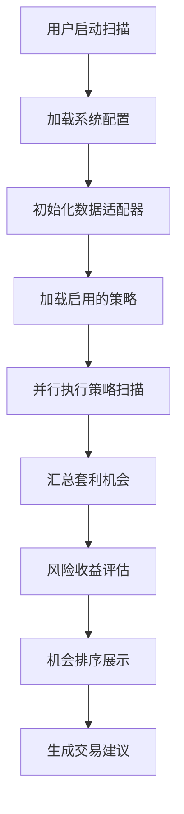
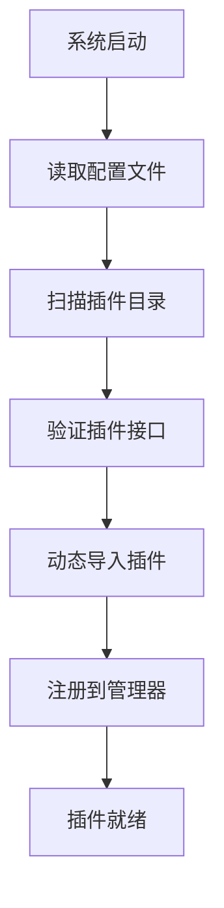

# 期权套利扫描工具 - 项目结构说明

## 🎯 设计理念

基于**插件化架构**和**配置驱动**的可扩展期权套利发现系统，采用三层架构设计：

- **表现层(UI Layer)**: Streamlit Web界面
- **业务层(Business Layer)**: 套利引擎 + 策略管理
- **数据层(Data Layer)**: 数据提供者 + 智能缓存

## 📁 完整目录结构

```
option_arbitrage_system/
├── 🚀 应用入口
│   ├── app.py                          # Streamlit主应用入口
│   ├── run.py                          # 命令行启动器
│   └── requirements.txt                # 依赖包清单
│
├── 🏗️ 核心源代码 (src/)
│   ├── __init__.py                     # 核心包初始化
│   │
│   ├── 📱 UI层 - 用户界面 (ui/)
│   │   ├── __init__.py
│   │   ├── dashboard.py                # 主控制台界面
│   │   ├── scanner_controls.py        # 扫描参数控制面板
│   │   └── results_viewer.py          # 套利结果展示组件
│   │
│   ├── 🧠 业务引擎层 (engine/)
│   │   ├── __init__.py
│   │   ├── arbitrage_engine.py         # 核心套利发现引擎
│   │   ├── opportunity_ranker.py       # 机会排序和评分器
│   │   └── risk_calculator.py          # 风险收益计算器
│   │
│   ├── 📈 策略模块 (strategies/)
│   │   ├── __init__.py
│   │   ├── base_strategy.py            # 策略基类和接口定义
│   │   ├── strategy_manager.py         # 策略管理器(插件化)
│   │   ├── pricing_arbitrage.py        # 定价套利策略(核心)
│   │   ├── parity_arbitrage.py         # 平价套利策略(稳健)
│   │   └── volatility_arbitrage.py     # 波动率套利策略(进攻)
│   │
│   ├── 📊 数据层 (data/)
│   │   ├── __init__.py
│   │   ├── data_provider.py            # 统一数据提供者接口
│   │   ├── market_data.py              # 实时市场数据服务
│   │   ├── option_data.py              # 期权基础数据服务
│   │   └── cache_manager.py            # 智能缓存管理器
│   │
│   ├── 🔌 适配器模块 (adapters/)
│   │   ├── __init__.py
│   │   ├── base_adapter.py             # 数据源适配器基类
│   │   ├── tushare_adapter.py          # Tushare数据源适配器
│   │   └── adapter_factory.py          # 适配器工厂
│   │
│   ├── ⚙️ 配置管理 (config/)
│   │   ├── __init__.py
│   │   ├── settings.py                 # 系统设置管理
│   │   ├── strategy_config.py          # 策略参数配置
│   │   └── risk_config.py              # 风险控制参数
│   │
│   └── 🔧 工具库 (utils/)
│       ├── __init__.py
│       ├── data_utils.py               # 数据处理工具
│       ├── math_utils.py               # 数学计算工具
│       ├── alert_utils.py              # 提醒通知工具
│       └── export_utils.py             # 结果导出工具
│
├── 🔌 插件系统 (plugins/)
│   ├── __init__.py
│   ├── plugin_manager.py               # 插件管理器
│   ├── plugin_interface.py             # 插件接口定义
│   └── [custom_plugins]/               # 自定义插件目录
│
├── 💾 数据存储 (storage/)
│   ├── cache/                          # 缓存数据存储
│   ├── history/                        # 历史套利记录
│   ├── logs/                           # 系统运行日志
│   └── exports/                        # 导出结果文件
│
├── ⚙️ 配置文件 (configs/)
│   ├── system.yaml                     # 系统核心配置
│   ├── strategies.yaml                 # 策略参数配置
│   └── risk.yaml                       # 风险控制配置
│
├── 🧪 现有代码集成 (legacy_logic/)
│   ├── simple_arbitrage_demo.py        # 已验证的套利演示
│   ├── option_arbitrage_scanner.py     # 现有扫描器
│   └── arbitrage_monitor.py            # 现有监控器
│
├── 🔧 环境配置
│   ├── .streamlit/config.toml          # Streamlit配置
│   ├── .env                           # 环境变量(TUSHARE_TOKEN等)
│   ├── venv/                          # 虚拟环境
│   └── requirements.txt                # Python依赖包
│
└── 📋 项目文档
    ├── README.md                       # 项目说明
    ├── SYSTEM_ARCHITECTURE.md         # 系统架构设计
    ├── TASK_SCHEDULE.md               # 任务调度计划
    └── PROJECT_STRUCTURE.md           # 本文档
```

## 🏗️ 架构设计特点

### 1. 插件化策略架构
- **策略接口**: `IArbitrageStrategy` 定义统一的策略接口
- **动态加载**: 通过配置文件控制策略的启用/禁用
- **策略管理**: `StrategyManager` 负责策略的注册、调度和执行
- **参数配置**: 每个策略都有独立的参数配置文件

### 2. 适配器模式数据源
- **统一接口**: `IDataAdapter` 定义数据源统一接口  
- **多源支持**: 支持Tushare、Wind、东方财富等多种数据源
- **自动切换**: 主数据源失效时自动切换到备用数据源
- **工厂模式**: `AdapterFactory` 负责数据源的创建和管理

### 3. 配置驱动系统
- **分层配置**: 系统配置、策略配置、风险配置分离
- **热更新**: 支持配置文件的热更新(无需重启)
- **环境适应**: 通过环境变量适应不同部署环境
- **参数验证**: 配置加载时自动验证参数有效性

### 4. 智能缓存机制
- **多级缓存**: 内存缓存 + 磁盘缓存 + Redis缓存
- **TTL管理**: 自动管理缓存的生存时间
- **批量预加载**: 智能预加载常用数据
- **缓存更新**: 实时数据更新时自动刷新缓存

## 🔄 核心工作流程

### 套利发现流程


### 插件加载流程


## 🎯 扩展方式

### 新增策略
1. 在 `src/strategies/` 创建新策略文件
2. 继承 `BaseStrategy` 并实现 `scan()` 方法
3. 在 `configs/strategies.yaml` 中注册策略
4. 系统自动发现并加载新策略

### 新增数据源
1. 在 `src/adapters/` 创建新适配器文件
2. 继承 `BaseAdapter` 并实现接口方法
3. 在 `configs/system.yaml` 中配置新数据源
4. 系统支持自动切换和负载均衡

### 新增插件
1. 在 `plugins/` 目录创建插件模块
2. 实现 `IPlugin` 接口
3. 插件管理器自动发现和加载
4. 支持热插拔和动态配置

## 🚀 快速开始

### 1. 环境准备
```bash
# 激活虚拟环境
source venv/bin/activate

# 安装依赖
pip install -r requirements.txt

# 配置环境变量
echo "TUSHARE_TOKEN=your_token_here" >> .env
```

### 2. 启动应用
```bash
# Web界面方式
python run.py --mode web --port 8501

# 或直接运行
streamlit run app.py
```

### 3. 配置调整
- 修改 `configs/system.yaml` 调整系统参数
- 修改 `configs/strategies.yaml` 调整策略参数
- 修改 `configs/risk.yaml` 调整风险控制参数

## 📊 性能优化

### 数据获取优化
- 批量请求减少API调用
- 智能缓存避免重复获取
- 并发处理提高响应速度
- 数据预加载减少等待时间

### 计算性能优化
- 向量化计算提高效率
- 并行策略执行
- 结果缓存避免重复计算
- 增量更新减少计算量

### 内存管理优化
- 数据分块处理
- 及时释放不用对象
- 缓存大小限制
- 内存使用监控

这个架构设计为后续的功能开发提供了坚实的基础，支持快速迭代和功能扩展。